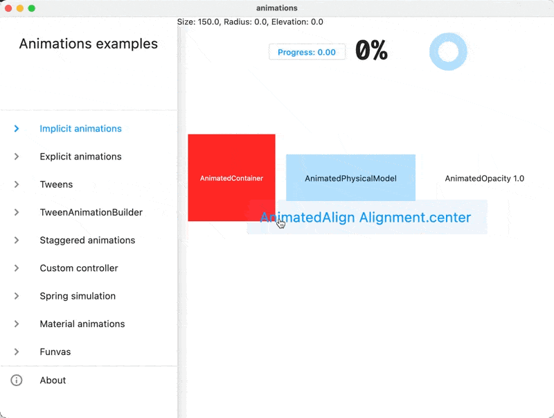

# animations

This is a showcase of several animation approaches in Flutter:

- implicit animations
- explicit animations
- TweenAnimationBuilder
- funvas
- animations package

Feel free to have fun with the app and let me know what you think :)

